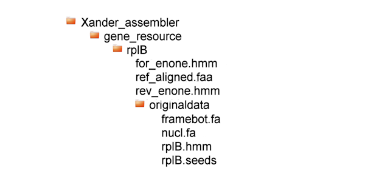

## Preparing Gene Resource Files

Go the the FunGene page (http://fungene.cme.msu.edu/) and see if your gene of interest has been already been entered. If not, you must select seed sequences covering the diversity of your gene. It requires some expertise to do this properly. Then contact the RDP staff (
http://rdp.cme.msu.edu/misc/contacts.jsp) and request that they add your seed sequences to FunGene. FunGene searches for related sequences and updates monthly, so if your gene is not already listed it is important to submit seed sequences as soon as possible. 

Reference sequence files and models for each gene targeted for assembly are placed in a gene reference directory. This directory is usually inside the Xander_assembler/gene_resource directory, but may be elsewhere if necessary (e.g. in your home directory on a cluster). The analysis pipeline is preconfigured for the genes rplB, amoA_AOA, AmoA_AOB, nifH, nirK, nirS, norB_cNor, norB_qNor, nosZ, and nosZ_a2. As you can see from these names, it is sometimes necessary to divide a gene into groups, depending on its sequence diversity.

The gene reference directory is named for the gene and contains files and the subdirectory originaldata in this configuration:

In this example, the gene directory is rplB. It contains three files and the sub-directory originaldata which in turn contains the four files required for preparing HMMs and for post-assembly processing. These are:

- rplB.seeds: a small set of protein sequences in FASTA format, used to build forward and reverse HMMs for the gene. These can be downloaded from FunGene.
- rplB.hmm: the HMM built from rplB.seeds using **HMMER** and can also be downloaded from FunGene.
- framebot.fa: a large near full length known protein set for identifying starting kmers and for FrameBot nearest matching.
- nucl.fa: a large near full length known set used by **UCHIME** for chimera checking.

All four of these files can be downloaded from FunGene. There are links to the gene.seeds and gene.hmm files in the upper left of each FunGene gene page. Near full-length and well annotated sequences are preferred for framebot.fa. Download these from FunGene, filtering with minimum HMM coverage of at least 80%. More diversity is better. More sequences mean more starting points, requiring more computational time, but make the process of model creation less susceptible to noise. Download nucleotide sequences to nucl.fa in a similar manner.

The script prepare_gene_ref.sh, present in /RDPTools/Xander_assembler/bin/, uses gene.seeds, gene.hmm, and the framebot.fa files in the originaldata directory to create the files for_enone.hmm, rev_enone.hmm, and ref_aligned.faa in the gene resource directory. The script does this using  hmmer-3.0_xanderpatch, a modified version of HMMMER3.0. The modified version is tuned to detect close orthologs. 

The ref_aligned.faa file in the gene resource directory contains the framebot.fa sequences aligned with for_enone.hmm and is used by Xander to identify starting kmers. It is important to manually examine the alignment of ref_aligned.faa using Jalview or  another alignment viewing tool to spot any badly aligned sequences. If found, it is likely that there are no sequences in gene.seeds close these sequences. You need to determine if these problem sequences are actually from your gene of interest, and then either remove them or add some representative sequences to gene.seeds and repeat the preparation steps. In some cases it will not be possible to get good alignments of ref_aligned.faa without dividing  the seed sequences and framebot.fa into subsets. And of course, in such cases, the gene.hmm needs to be built for each subset of the seeds.

Check the file permissions for the files in the gene resource directory to be sure they are all readable by user, group, and world. If not, make them so (chmod 644 filename). Then test that your new gene resource files work by running Xander with a subset of framebot.fa as the sample sequences (SEQFILE). You will not be able to get a summary by phylum without adding taxonomy to the sequence descriptions in framebot.fa.

## Add Taxonomy to framebot.fa

Once assured that your new gene resource files work, you can add taxonomy to the framebot.fa file. Adding the taxonomy requires python, Biopython, and an internet connection. If necessary, you may install Biopython with the following command:

    sudo apt-get install python-biopython

Create a directory and put a copy of framebot.fa in it. For example, if you have been working on adding capability for the gene but, you might do the following:

    mkdir ~/add_taxonomy
    cd ~/add_taxonomy
    cp /usr/RDPTools/Xander_assembler/gene_resource/but/originaldata/framebot.fa ~/add_taxonomy/

Then, from the add_taxonomy directory, run the script below. But first edit the path to the pythonscripts directory as appropriate and make sure the script is executable.

    #!/bin/bash
    
    # Configure the path to the pythonscripts directory:
    scripts_dir=/usr/RDPTools/Xander_assembler/pythonscripts
    
    # Parse the accession numbers to the file accnos.txt:
    cat framebot.fa | grep ">" |  sed 's/\(>\)\([0-9]*\)\(.*\)/\2/' > accnos.txt
    
    # For each accession number, download the GenBank file in xml format:
    python $scripts_dir/fetch_ncbi_xml.py protein accnos.txt ./temp xml
    
    # Parse the phylogenies from the xml files and write them to the 
    # framebot.fa sequence descriptions:
    python $scripts_dir/parse_ncbi_lineage.py  framebot.fa  ./temp  ./temp/framebot.fa
    
The above script creates directory temp under your working directory (~/add_taxonomy) and makes a copy of framebot.fa in that directory with the taxonomy included in the sequence descriptions. If you replace the framebot.fa in the gene resource directory with this modified version, then Xander will be able to include taxonomy in its output.
